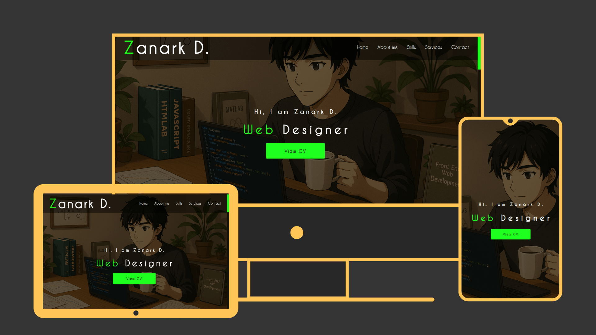

# 🌐 Custom Portfolio Website

A responsive and stylish personal portfolio built with HTML, CSS, and JavaScript. Showcases sections like home, services, skills, about me, and contact with smooth animations and clean design.

## 🌟 Features

- 🎨 Modern and unique UI design  
- 📱 Fully responsive layout for desktop and mobile  
- ✨ Fade-in section animations triggered on scroll (30% visible)  
- 🖱️ Customized scrollbar for a polished look  
- 📂 Well-structured and maintainable code  

## 🧰 Tech Stack

- HTML  
- CSS  
- Vanilla JavaScript  

## 🚀 Live Demo

Try it here 👇  
https://zeddy-foreal.github.io/custom-portfolio-website

## 📸 Preview



## 📁 How to Run Locally

```bash
git clone https://github.com/zeddy-foreal/custom-portfolio-website.git
cd custom-portfolio-website
# Then open index.html in your browser

